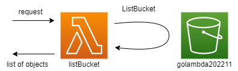

# go-lambda202211



## 事前準備

### AWS クレデンシャル設定

```bash
aws configure
```

### S3バケット準備

1. バケットを作成
2. 作成したバケットのバケット名を `list_bucket_handler.go:18` に入力する

    ```go
    const (
        S3BUCKET = "{作成したバケット名}"
    )
    ```

## テスト

```bash
go test ./...
```

## デプロイ

1. ビルド

    ```bash
    GOOS=linux go build -o dist/list_bucket_handler
    ```

1. デプロイ

    ```bash
    serverless deploy
    ```

    us-west-2 リージョンにデプロイされます。

## 削除

```bash
serverless remove
```
